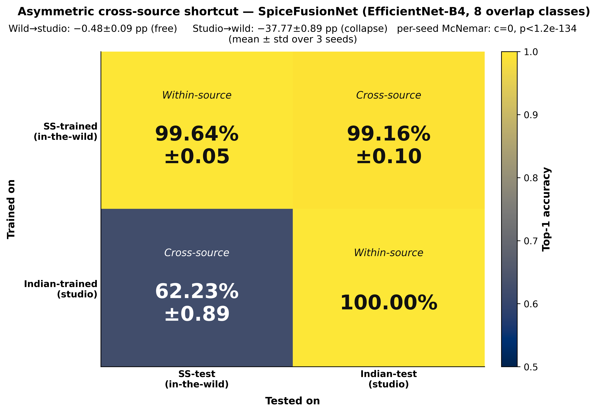
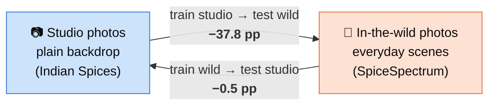
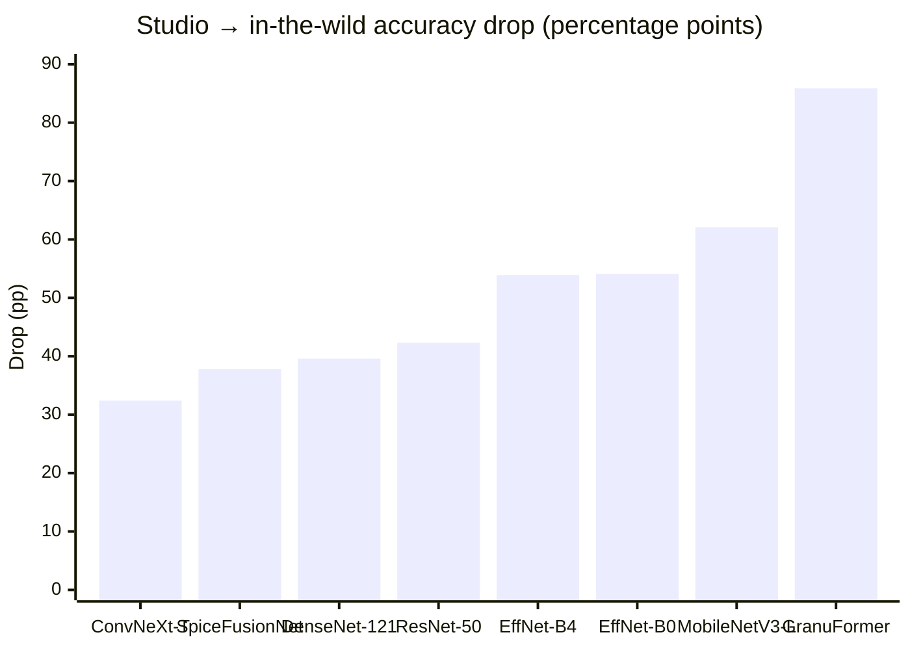
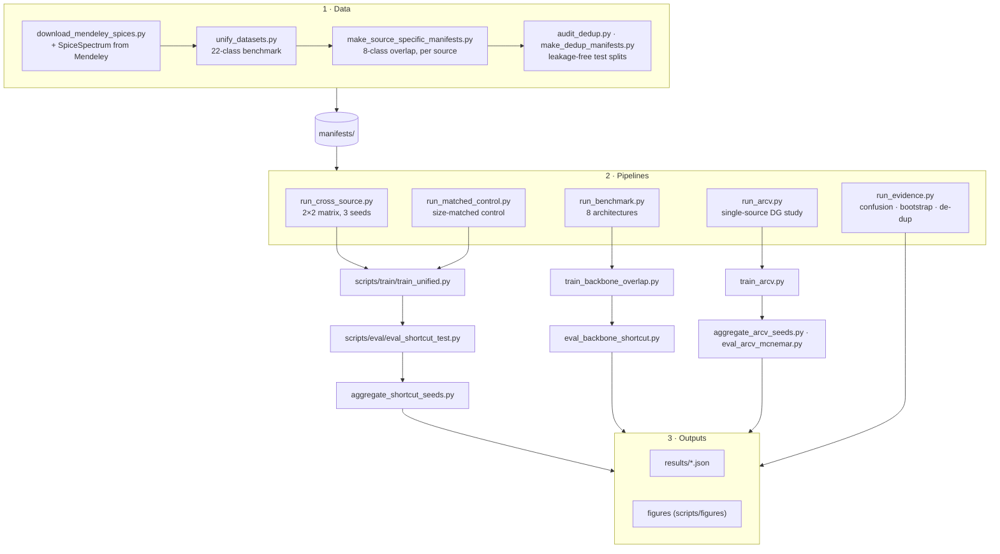

<div align="center">

# SpiceNet

**Quantifying and Narrowing the Acquisition-Transfer Gap in Image-Based Spice Identification**

Md. Noushad Jahan Ramim · Maisha Sameha · Nazmun Nahid<br>
University of Asia Pacific, Bangladesh

[](https://noushad999.github.io/spicenet/)
[](https://doi.org/10.57967/hf/9655)
[](https://github.com/noushad999/spicenet/actions)


[](LICENSE)

</div>

---

Published spice classifiers report accuracy close to 100%, but they are trained and tested on one
style of photograph. SpiceNet joins two public collections, **studio** photographs on plain backdrops
and **in-the-wild** photographs of everyday scenes, into a 22-class benchmark of about 22,000
images, and asks what happens when a model meets the source it did not train on.

The answer is a sharp **asymmetry**:

| Train on → test on | Accuracy (3 seeds) | Cost of switching source |
|---|---:|---:|
| studio → studio | 100.00% | |
| studio → **in-the-wild** | **62.23 ± 0.89%** | **−37.77 ± 0.89 pp** |
| in-the-wild → in-the-wild | 99.64 ± 0.05% | |
| in-the-wild → studio | 99.16 ± 0.10% | −0.48 ± 0.09 pp |

Pooled over three seeds, the in-the-wild model fixes **1,367** of the studio model's errors and makes
**0** new errors of its own (McNemar *b* = 1367, *c* = 0, *p* = 8.5 × 10⁻²⁹⁹).

> **Explore the results interactively →** [noushad999.github.io/spicenet](https://noushad999.github.io/spicenet/)
> (switch seeds on the 2×2 matrix, sort the architectures, drop coriander and see what is left).

<p align="center">
  
</p>

## Key findings



1. **The collapse is one-directional.** Studio-trained models fall by 37.8 points in the wild; the
   reverse direction costs about 0.5.
2. **It is not one bad class.** Coriander is where it hurts most (the two sources photograph
   different plant organs), but dropping it still leaves a **29.9-point** collapse against 0.4 in reverse.
3. **It is not training-set size.** Subsampling the in-the-wild source to the studio count leaves its
   transfer cost at **0.65 ± 0.28 pp** against 37.8 in the other direction.
4. **It survives de-duplication.** On leakage-free test splits the gap is 38.8 vs 0.8 pp (seed 42).
5. **It lives in the features.** Class directions fitted on studio features transfer to the wild at
   0.601 against the deployed model's 0.622, so recalibrating the classifier head on site will not fix it.
6. **Every architecture collapses.** Eight models, from MobileNetV3 to a transformer, lose 32 to 86 points.
7. **Cheap fixes help a little.** Under a single training source, feature-space mixing (ARC-V) and a
   one-line logit penalty (spectral decoupling) each recover about 6 of the 38 lost points, and the two
   cannot be told apart at three seeds.

### Every architecture collapses in the same direction



<details>
<summary><b>Table: both transfer directions for all eight architectures</b></summary>

| Model | Studio (within) | Forward drop (studio → wild) | Reverse drop (wild → studio) |
|---|---:|---:|---:|
| ConvNeXt-Tiny | 100.0 | 32.4 | 0.75 |
| SpiceFusionNet (ours) | 100.0 | 37.8 | 0.48 |
| DenseNet-121 | 100.0 | 39.6 | 3.46 |
| ResNet-50 | 99.8 | 42.3 | 7.75 |
| EfficientNet-B4 | 100.0 | 53.9 | 2.27 |
| EfficientNet-B0 | 100.0 | 54.1 | 0.13 |
| MobileNetV3-Large | 100.0 | 62.1 | −0.13 |
| GranuFormer | 100.0 | 85.9 | 15.07 |

Rows are not protocol-matched, so the ordering is **not a ranking**: the six added backbones and
GranuFormer are single-seed, while the SpiceFusionNet row is the three-seed mean. The robust finding
is that every model loses 32 to 86 points in the forward direction.
Source: [`results/benchmark_table.md`](results/benchmark_table.md), `results/bench_*.json`.
</details>

<details>
<summary><b>Table: per-class accuracy of the studio-trained model in the wild</b></summary>

| Class | Studio | In-the-wild | Drop |
|---|---:|---:|---:|
| coriander | 100.00 | **8.17** | 91.83 |
| black pepper | 100.00 | 43.94 | 56.06 |
| green cardamom | 100.00 | 51.28 | 48.72 |
| cumin | 100.00 | 64.96 | 35.04 |
| cloves | 100.00 | 67.34 | 32.66 |
| cinnamon | 100.00 | 83.02 | 16.98 |
| nutmeg | 100.00 | 88.02 | 11.98 |
| ginger | 100.00 | 91.11 | 8.89 |

Three-seed mean. Small look-alike seeds fall hardest; shape-dominant classes (ginger, nutmeg) hold.
</details>

<details>
<summary><b>Table: single-source interventions (studio → in-the-wild, held out)</b></summary>

| Method | In-the-wild accuracy | Collapse |
|---|---:|---:|
| Ordinary training (ERM) | 61.71 ± 1.82 | 38.29 ± 1.82 |
| Self-challenging (RSC) | 63.68 ± 2.35 | 36.32 ± 2.35 |
| Statistic mixing only (MixStyle) | 64.78 | 35.22 |
| Amplitude mixing only (Fourier) | 66.34 | 33.66 |
| **ARC-V** (both) | **67.32 ± 1.72** | **32.68 ± 1.72** |
| **Spectral decoupling** | **67.60 ± 0.84** | **32.40 ± 0.84** |

Mean ± std over seeds 42, 1337, 2024; the two ablation rows are seed 42 only. ARC-V vs ERM, pooled
McNemar: *b* = 359, *c* = 155, *p* = 3.4 × 10⁻¹⁹ ([`results/arcv_mcnemar.txt`](results/arcv_mcnemar.txt)).
</details>

## Repository layout

```
spicenet/
├── config.py               paths, classes, hyper-parameters (one place)
├── src/                    the library
│   ├── model.py            SpiceFusionNet: EfficientNet-B4 + texture (LBP/GLCM) + colour (HSV), gated fusion
│   ├── dataset.py          manifest loading, transforms, path resolution
│   ├── trainer.py          three-phase trainer (CE → SupCon → fusion)
│   ├── losses.py · features.py · gradcam.py · baselines.py · utils.py · figstyle.py
│   └── dg/                 domain-generalization modules
│       ├── arcv.py         ARC-V objective (MixStyle + Fourier amplitude mix + phase consistency)
│       ├── mixstyle.py · fourier.py · rsc.py · sd.py
│       └── dann.py · coral.py · irm.py
├── pipelines/              one command per experiment in the paper
├── scripts/
│   ├── data/               download, unify, manifests, de-duplication audit
│   ├── train/              training entry points
│   ├── eval/               cross-source evaluation, statistics, aggregation
│   └── figures/            every figure and table in the paper
├── manifests/              released deterministic 70/15/15 splits (image paths are relative)
├── results/                the numbers behind the paper (JSON / Markdown)
├── tests/                  unit tests for the model, features and DG modules
└── docs/                   interactive project page (GitHub Pages)
```

## How the code fits together



## Getting started

### 1. Install

```bash
git clone https://github.com/noushad999/spicenet.git
cd spicenet
python -m venv .venv && source .venv/bin/activate   # Windows: .venv\Scripts\activate
pip install -r requirements.txt
pytest -q tests                                     # 37 tests, CPU only, a few seconds
```

### 2. Get the images

The images are **not redistributed** here. Download both collections into `data/` (or anywhere,
then set `SPICENET_DATA=/path/to/folder`):

| Source | Role | License | Where |
|---|---|---|---|
| SpiceSpectrum | in-the-wild | CC BY-ND 4.0 | [doi:10.1016/j.dib.2025.112097](https://doi.org/10.1016/j.dib.2025.112097) → `data/Spice_Spectrum/` |
| Indian Spices | studio | CC BY 4.0 | [doi:10.1016/j.dib.2024.110936](https://doi.org/10.1016/j.dib.2024.110936), or run `python scripts/data/download_mendeley_spices.py` → `data/Indian_Spices/` |

Then install the released splits (every script reads them from `outputs/`):

```bash
python scripts/data/install_manifests.py
```

The manifests store paths such as `Spice_Spectrum/cumin/cumin_12.jpg`; they are resolved against
`SPICENET_DATA` at load time, so the same splits work on any machine.

### 3. Reproduce the paper

Every pipeline supports `--smoke` (one epoch, one seed, a few minutes) to check the setup first.
Runs are resumable and skip checkpoints that already exist.

<details open>
<summary><b>The asymmetric collapse (headline 2×2 matrix, 3 seeds)</b></summary>

```bash
python pipelines/run_cross_source.py --smoke
python pipelines/run_cross_source.py            # trains 6 models, evaluates, aggregates, draws figures
python pipelines/run_evidence.py                # confusion, bootstrap CIs, de-duplicated re-test
```
</details>

<details>
<summary><b>Size-matched control</b></summary>

```bash
python pipelines/run_matched_control.py         # subsamples the wild source to the studio count, 3 seeds
```
</details>

<details>
<summary><b>Eight-architecture benchmark</b></summary>

```bash
python pipelines/run_benchmark.py --cooldown 180
python scripts/figures/make_benchmark_table.py
```
</details>

<details>
<summary><b>Single-source interventions (ERM, RSC, ARC-V, spectral decoupling)</b></summary>

```bash
python pipelines/run_arcv.py --smoke
python pipelines/run_arcv.py --methods erm arcv rsc sd --seed 42
python pipelines/run_arcv.py --methods erm arcv rsc sd --seed 1337
python pipelines/run_arcv.py --methods erm arcv rsc sd --seed 2024
python scripts/eval/aggregate_arcv_seeds.py
python scripts/eval/eval_arcv_mcnemar.py
```
</details>

<details>
<summary><b>Individual scripts</b></summary>

Every script runs from the repository root and prints its options with `--help`:

```bash
python scripts/train/train_unified.py --help
python scripts/eval/eval_shortcut_test.py --ss_ckpt <wild.pth> --in_ckpt <studio.pth>
python scripts/eval/eval_calibration.py --help
python scripts/eval/eval_source_probe.py --help
python scripts/eval/predict.py --help
```
</details>

The pipelines pause between training runs (`--cooldown`) to keep a consumer GPU's temperature down.
All experiments in the paper ran on a single consumer GPU.

## Scope and honest notes

- **Images and checkpoints** are not in this repository. Checkpoints are archived with the manifests
  at [doi:10.57967/hf/9655](https://doi.org/10.57967/hf/9655).
- **GranuFormer** and **AIFNet** appear in the paper's tables, but their source code is not part of this
  release; their numbers are reported from the saved results in `results/`.
- **Two sources only.** The asymmetry is measured on one studio and one in-the-wild collection. The
  size-matched control rules out training-set size, but a third source is needed to generalize the claim.

## Citation

```bibtex
@article{ramim2026spicenet,
  title   = {SpiceNet: Quantifying and Narrowing the Acquisition-Transfer Gap in
             Image-Based Spice Identification},
  author  = {Ramim, Md. Noushad Jahan and Sameha, Maisha and Nahid, Nazmun},
  year    = {2026},
  note    = {Manuscript under review}
}
```

Please also cite the two source collections:
SpiceSpectrum ([Ramim et al., 2025](https://doi.org/10.1016/j.dib.2025.112097)) and
Indian Spices ([Thite et al., 2024](https://doi.org/10.1016/j.dib.2024.110936)).

## License

Code and manifests: [MIT](LICENSE). The source images keep their own licenses (CC BY-ND 4.0 and
CC BY 4.0) and are not included.
